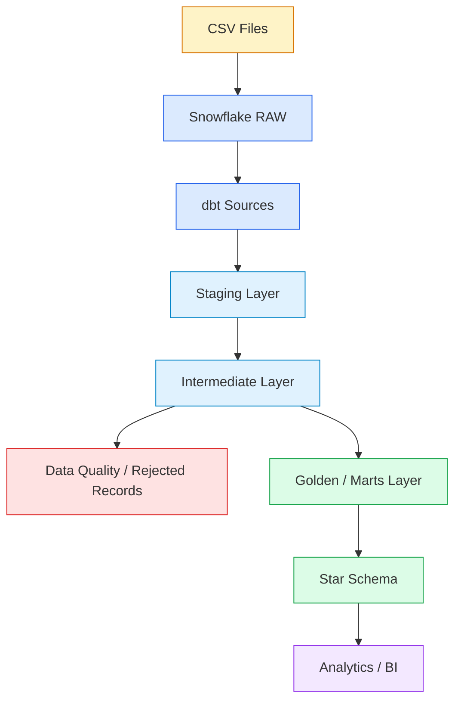
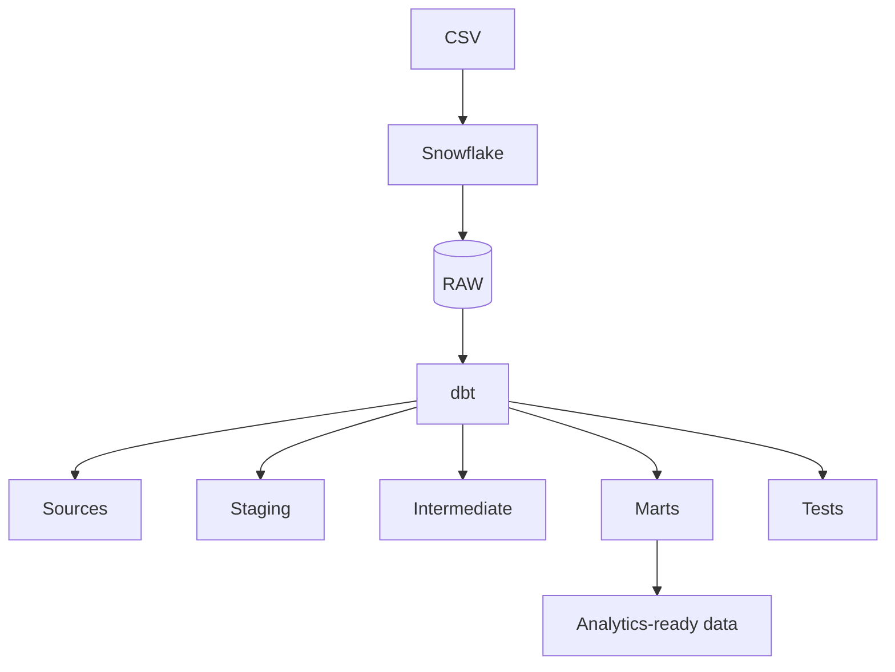
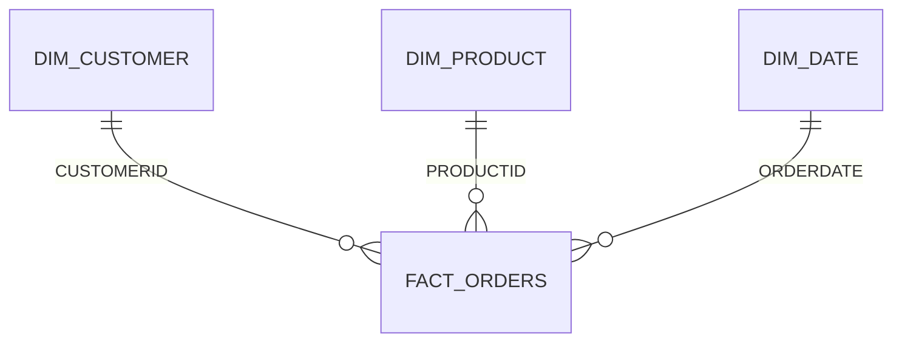
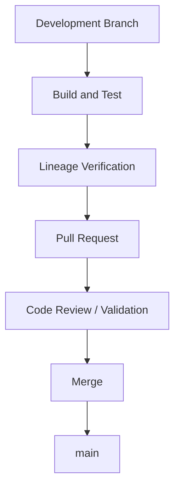
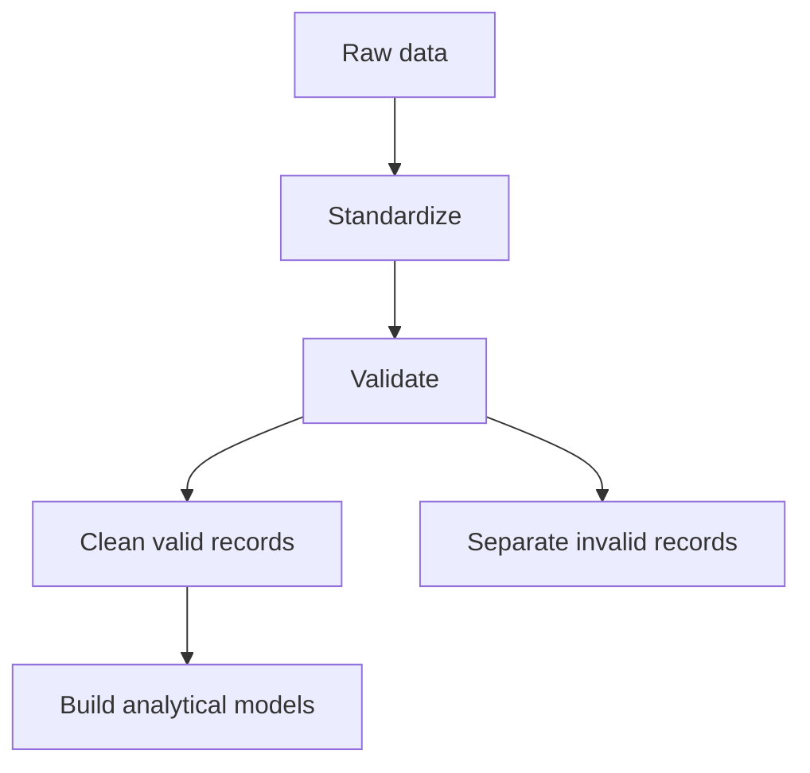
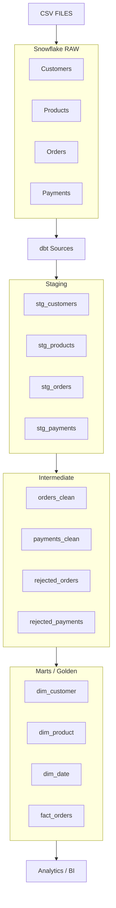

# ShopFlow — E-Commerce ELT Data Pipeline

An end-to-end e-commerce data engineering project built using **Snowflake, dbt, SQL, and GitHub**.

The pipeline transforms raw customer, product, order, and payment CSV data into a tested analytical star schema.

**Pipeline:** `CSV → Snowflake RAW → dbt Staging → Intermediate → Marts/Golden → Analytics`

**Final dbt build:** ✅ 25/25 PASS | 0 WARNINGS | 0 ERRORS

**Author:** Adithya K

---

## Table of Contents

1. [Project Overview](#1-project-overview)
2. [Project Objectives](#2-project-objectives)
3. [Technologies Used](#3-technologies-used)
4. [Source Data](#4-source-data)
5. [Snowflake Architecture](#5-snowflake-architecture)
6. [dbt Architecture](#6-dbt-architecture)
7. [dbt Sources](#7-dbt-sources)
8. [Staging Layer](#8-staging-layer)
9. [Intermediate Layer](#9-intermediate-layer)
10. [Order Data Cleaning](#10-order-data-cleaning)
11. [Rejected Orders](#11-rejected-orders)
12. [Payment Cleaning](#12-payment-cleaning)
13. [Rejected Payments](#13-rejected-payments)
14. [Marts / Golden Layer](#14-marts--golden-layer)
15. [Dimension Tables](#15-dimension-tables)
16. [Fact Table](#16-fact-table)
17. [Revenue Calculation](#17-revenue-calculation)
18. [Data Quality](#18-data-quality)
19. [dbt Tests](#19-dbt-tests)
20. [Final Test Result](#20-final-test-result)
21. [Lineage](#21-lineage)
22. [Why the Lineage Is Important](#22-why-the-lineage-is-important)
23. [GitHub and Version Control](#23-github-and-version-control)
24. [Project Directory Structure](#24-project-directory-structure)
25. [Business Questions Supported](#25-business-questions-supported)
26. [Important Data-Quality Findings](#26-important-data-quality-findings)
27. [Data Cleaning Strategy](#27-data-cleaning-strategy)
28. [Design Decisions](#28-design-decisions)
29. [Current Architecture](#29-current-architecture)
30. [Production Considerations](#30-production-considerations)
31. [Limitations](#31-limitations)
32. [Future Improvements](#32-future-improvements)
33. [Final Project Result](#33-final-project-result)
34. [Final One-Line Summary](#34-final-one-line-summary)

---

## 1. Project Overview

**ShopFlow** is an end-to-end e-commerce ELT data pipeline built using **Snowflake and dbt**.

The project processes customer, product, order, and payment data from CSV files and transforms the raw data into a clean, tested, analytics-ready data warehouse model.

The main objective is to demonstrate how raw transactional data can be transformed into a reliable analytical data model using modern data engineering and analytics engineering practices.

### Project workflow



Plain-text version:

```text
CSV Files
    ↓
Snowflake RAW
    ↓
dbt Sources
    ↓
Staging Layer
    ↓
Intermediate Layer
    ↓
Data Quality / Rejected Records
    ↓
Golden / Marts Layer
    ↓
Star Schema
    ↓
Analytics / BI
```

The project uses an **ELT (Extract, Load, Transform)** architecture:

- **Extract** — Data originates from CSV files.
- **Load** — CSV data is loaded into Snowflake RAW tables.
- **Transform** — dbt transforms the data inside Snowflake.
- **Validate** — dbt data tests validate the transformed datasets.
- **Consume** — The final Golden/Marts layer is designed for analytical queries and BI reporting.

dbt is used as the transformation and analytics-engineering layer, while Snowflake provides the warehouse and SQL execution environment. dbt models are modular SQL transformations, and dbt builds dependency relationships between them.

> **Note:** dbt does not load the CSV files into Snowflake. The CSV data is loaded into Snowflake first, and dbt then works on those Snowflake tables.

---

## 2. Project Objectives

1. Load raw e-commerce data into Snowflake.
2. Define Snowflake RAW tables as dbt sources.
3. Create reusable staging models.
4. Clean and validate transactional data.
5. Handle invalid and rejected records separately.
6. Remove duplicate order records.
7. Handle null and invalid order quantities.
8. Handle invalid order dates.
9. Validate customer and product relationships.
10. Build a dimensional data warehouse model.
11. Create an analytical fact table.
12. Implement dbt data-quality tests.
13. Generate model dependencies and lineage.
14. Version-control the project using GitHub.
15. Produce an analytics-ready dataset for downstream reporting.

---

## 3. Technologies Used

| Technology | Purpose                                           |
| ---------- | ------------------------------------------------- |
| CSV        | Source data                                       |
| Snowflake  | Cloud data warehouse                              |
| SQL        | Data transformation                               |
| dbt        | ELT transformation, modeling, testing and lineage |
| GitHub     | Version control                                   |
| dbt Studio | Development environment                           |

### Technology architecture



---

## 4. Source Data

The project uses four CSV datasets.

### 4.1 Customers

Contains customer information such as:

- Customer ID
- Age
- City
- Signup Date
- Customer Segment

Source table: `SK_TRAINING_DB.RAW.CUSTOMERS`

### 4.2 Products

Contains product information such as:

- Product ID
- Product Name
- Category
- Unit Price

Source table: `SK_TRAINING_DB.RAW.PRODUCTS`

### 4.3 Orders

Contains transactional order information such as:

- Order ID
- Customer ID
- Product ID
- Order Date
- Quantity
- Discount
- Order Status

Source table: `SK_TRAINING_DB.RAW.ORDERS`

### 4.4 Payments

Contains payment information such as:

- Order ID
- Payment Status

Source table: `SK_TRAINING_DB.RAW.PAYMENTS`

---

## 5. Snowflake Architecture

The Snowflake database used for the project is `SK_TRAINING_DB`.

```text
SK_TRAINING_DB
│
├── RAW
│
├── SILVER
│
├── GOLDEN
│
└── DBT_AK
```

### RAW

Contains the original loaded source data.

```text
RAW
├── CUSTOMERS
├── PRODUCTS
├── ORDERS
└── PAYMENTS
```

The RAW layer is the starting point for dbt transformations.

### SILVER

The SILVER schema was used during development and validation for manually exploring data-cleaning and data-quality issues. It contains cleaned and rejected datasets created during the earlier transformation work.

Examples:

```text
SILVER.CUSTOMERS
SILVER.PRODUCTS
SILVER.ORDERS
SILVER.ORDERS_CLEAN
SILVER.PAYMENTS
SILVER.PAYMENTS_CLEAN
SILVER.REJECTED_ORDERS
SILVER.REJECTED_PAYMENTS
```

> The final documented transformation workflow is implemented using **dbt models** (output schema `DBT_AK`), rather than relying on these manually created tables. The `SILVER` and `GOLDEN` tables were part of development/validation work and are not maintained in parallel with the dbt pipeline.

---

## 6. dbt Architecture

The dbt project is organized into three transformation layers:

```text
models/
│
├── staging/
│
├── intermediate/
│
└── marts/
```

This separation makes the transformation process easier to understand, maintain, test, and extend.

---

## 7. dbt Sources

The file `models/source.yml` defines the Snowflake RAW tables as dbt sources.

```yaml
sources:
  - name: raw
    database: SK_TRAINING_DB
    schema: RAW
```

The four source tables are:

```text
raw.customers
raw.products
raw.orders
raw.payments
```

The staging models use:

```sql
{{ source('raw', 'customers') }}
```

and similar source references.

dbt sources allow raw warehouse tables to be named, documented, tested, and represented in the lineage graph.

---

## 8. Staging Layer

The staging layer is the first transformation layer, located in `models/staging/`:

```text
stg_customers.sql
stg_products.sql
stg_orders.sql
stg_payments.sql
```

The purpose of staging is to perform basic standardization without applying complex business logic.

### 8.1 `stg_customers`

- Select required columns.
- Remove duplicate records.
- Trim city values.
- Standardize customer segment naming.
- Preserve customer attributes.

Output: `DBT_AK.STG_CUSTOMERS`

### 8.2 `stg_products`

- Select required product columns.
- Remove duplicate product records.
- Trim product names.
- Trim category names.
- Preserve unit price.

Output: `DBT_AK.STG_PRODUCTS`

### 8.3 `stg_orders`

- Select required order columns.
- Rename `STATUS` to `ORDER_STATUS`.
- Preserve order date.
- Preserve quantity and discount.

Output: `DBT_AK.STG_ORDERS`

### 8.4 `stg_payments`

- Select order ID.
- Select payment status.
- Prepare payment data for validation and integration.

Output: `DBT_AK.STG_PAYMENTS`

---

## 9. Intermediate Layer

The intermediate layer contains the main data-cleaning and validation logic, located in `models/intermediate/`:

```text
orders_clean.sql
payments_clean.sql
rejected_orders.sql
rejected_payments.sql
```

---

## 10. Order Data Cleaning

The `orders_clean` model creates the trusted order dataset. The cleaning rules are:

### Positive quantity

Orders with `QUANTITY > 0` are accepted. Records where `QUANTITY IS NULL` or `QUANTITY <= 0` are rejected.

### Valid order date

Orders must contain a valid `ORDERDATE`. Orders with a null order date are excluded from the clean dataset.

### Duplicate order handling

The model uses a window function:

```sql
ROW_NUMBER() OVER (
    PARTITION BY ORDERID
    ORDER BY ORDERDATE DESC
)
```

This identifies multiple records belonging to the same order. Only the latest valid record is retained, which ensures that the final fact table maintains the intended grain:

> **One row per order.**

---

## 11. Rejected Orders

Instead of silently deleting invalid records, the project separates them into the `rejected_orders` model. Rejected orders include records with:

- Null quantity
- Non-positive quantity
- Null order date

This provides a simple data-quality quarantine pattern. Invalid records remain available for investigation rather than disappearing from the pipeline.

---

## 12. Payment Cleaning

The `payments_clean` model connects payment records with valid orders.

```text
stg_payments
        ↓
orders_clean
        ↓
payments_clean
```

Only payments associated with valid orders are included in the clean payment dataset.

---

## 13. Rejected Payments

Payment records that do not have a corresponding valid order are stored in `rejected_payments`. This allows the pipeline to identify orphan payment records instead of silently dropping them.

---

## 14. Marts / Golden Layer

The final analytical layer is implemented under `models/marts/`:

```text
dim_customer.sql
dim_product.sql
dim_date.sql
fact_orders.sql
```

These models form a **star-schema style analytical model**.



```text
                DIM_CUSTOMER
                     │
                     ▼
DIM_PRODUCT ─── FACT_ORDERS ─── DIM_DATE
                     ▲
                     │
                PAYMENT DATA
```

---

## 15. Dimension Tables

### 15.1 Customer Dimension — `dim_customer`

Columns: `CUSTOMERID`, `AGE`, `CITY`, `SIGNUPDATE`, `CUSTOMER_SEGMENT`

Provides descriptive information about customers for analytical reporting.

### 15.2 Product Dimension — `dim_product`

Columns: `PRODUCTID`, `PRODUCTNAME`, `CATEGORY`, `UNITPRICE`

Provides product-level descriptive information for sales analysis.

### 15.3 Date Dimension — `dim_date`

Columns: `DATE`, `YEAR`, `MONTH`, `MONTH_NAME`, `DAY`, `DAY_NAME`, `WEEK`

Provides calendar attributes that make time-based analysis easier, for example:

- Revenue by year
- Revenue by month
- Orders by day
- Weekly sales analysis

---

## 16. Fact Table

The main analytical fact table is `fact_orders`.

### Grain

> **One row per valid order.**

Every metric must be interpreted according to this grain.

### Fact columns

```text
ORDERID
CUSTOMERID
PRODUCTID
ORDERDATE
QUANTITY
DISCOUNT
UNITPRICE
REVENUE
ORDER_STATUS
PAYMENTSTATUS
```

---

## 17. Revenue Calculation

```text
Revenue = Quantity × Unit Price × (1 − Discount)
```

SQL implementation:

```sql
o.QUANTITY
    * p.UNITPRICE
    * (1 - o.DISCOUNT) AS REVENUE
```

This allows the fact table to directly support sales and revenue analysis.

---

## 18. Data Quality

Data quality is one of the main components of this project. The project validates:

- Primary-key uniqueness
- Required fields
- Referential integrity
- Valid order records
- Duplicate orders
- Invalid quantities
- Missing order dates
- Invalid customer references
- Invalid payment references

dbt data tests are assertions against the resulting data. Built-in tests include `unique`, `not_null`, `accepted_values`, and `relationships`.

---

## 19. dbt Tests

Tests are defined in `models/schema.yml`.

| Model / Column            | Tests                                   |
| ------------------------- | --------------------------------------- |
| Customer ID               | `unique`, `not_null`                    |
| Product ID                | `unique`, `not_null`                    |
| Date                      | `unique`, `not_null`                    |
| Order ID                  | `unique`, `not_null`                    |
| `fact_orders.CUSTOMERID`  | `relationships` → `dim_customer.CUSTOMERID` |
| `fact_orders.PRODUCTID`   | `relationships` → `dim_product.PRODUCTID`   |

These tests validate both structural integrity and referential integrity.

---

## 20. Final Test Result

The final dbt build was executed successfully.

```text
dbt build

Total:    25
Passed:   25
Warnings: 0
Errors:   0
Skipped:  0
```

```text
✅ 25/25 PASS
✅ 0 WARNINGS
✅ 0 ERRORS
```

This confirms that the current dbt project successfully builds and passes its configured data-quality tests.

---

## 21. Lineage

The dbt lineage graph shows how data flows from the RAW source tables through the transformation layers into the final analytical models.


*Figure: dbt lineage graph for ShopFlow — sources (`SRC`) on the left, models (`MDL`) flowing through staging, intermediate, and marts layers.*

### Lineage explanation

```text
RAW CUSTOMERS → STG_CUSTOMERS → DIM_CUSTOMER
```

```text
RAW PRODUCTS → STG_PRODUCTS → DIM_PRODUCT
```

```text
RAW ORDERS → STG_ORDERS → ORDERS_CLEAN ──┬──→ DIM_DATE
                                          └──→ FACT_ORDERS
```

```text
RAW PAYMENTS → STG_PAYMENTS → PAYMENTS_CLEAN → FACT_ORDERS
```

Rejected records are also represented:

```text
STG_ORDERS   → REJECTED_ORDERS
STG_PAYMENTS → REJECTED_PAYMENTS
```

The lineage is generated from the dependencies defined through dbt's `source()` and `ref()` functions. `ref()` creates dependencies between models and allows dbt to determine the correct build order.

---

## 22. Why the Lineage Is Important

The lineage graph provides visibility into:

- Where data originates.
- Which transformations are applied.
- Which models depend on other models.
- Where a source change could affect downstream models.
- How the final fact table is constructed.
- How rejected records are separated from trusted records.

For example, if the RAW orders table changes, the lineage makes it possible to identify the downstream models affected by that change.

---

## 23. GitHub and Version Control

The project is maintained using GitHub.



The completed project has been merged into the `main` branch, which provides version control and keeps the final implementation reproducible.

---

## 24. Project Directory Structure

```text
dbt/
│
├── models/
│   │
│   ├── staging/
│   │   ├── stg_customers.sql
│   │   ├── stg_products.sql
│   │   ├── stg_orders.sql
│   │   └── stg_payments.sql
│   │
│   ├── intermediate/
│   │   ├── orders_clean.sql
│   │   ├── payments_clean.sql
│   │   ├── rejected_orders.sql
│   │   └── rejected_payments.sql
│   │
│   ├── marts/
│   │   ├── dim_customer.sql
│   │   ├── dim_product.sql
│   │   ├── dim_date.sql
│   │   └── fact_orders.sql
│   │
│   ├── schema.yml
│   └── source.yml
│
├── analyses/
├── macros/
├── seeds/
├── snapshots/
├── tests/
├── docs/
│   └── images/
│       └── dbt_lineage.png
│
├── dbt_project.yml
├── README.md
└── .gitignore
```

---

## 25. Business Questions Supported

### Sales

- What is the total revenue?
- What is revenue by month?
- What is revenue by product?
- What is revenue by category?

### Customers

- How many customers are active?
- Which customer segments generate the most revenue?
- What is revenue by city?
- How many orders does each customer place?

### Products

- Which products generate the most revenue?
- Which categories generate the most revenue?
- What is the average selling price?

### Orders

- How many orders are completed?
- How many orders are returned?
- How many orders are cancelled?
- What is the average order quantity?

### Payments

- How many payments are paid?
- How many payments failed?
- How many payments were refunded?

Because the fact table contains order, product, customer, date, and payment information, these questions can be answered using the analytical model without repeatedly transforming the raw data.

---

## 26. Important Data-Quality Findings

During development, several data-quality issues were identified:

```text
Invalid customer references
Null quantities
Non-positive quantities
Null order dates
Duplicate order records
Payments without valid orders
```

Instead of simply deleting these records, the project introduced separate rejected datasets, providing greater transparency into the quality of the source data.

---

## 27. Data Cleaning Strategy



The pipeline does not treat every source record as automatically trustworthy. The clean models contain records that satisfy the defined business/data-quality rules, while rejected models preserve records requiring further investigation.

---

## 28. Design Decisions

### Why Snowflake?

Snowflake provides the cloud data warehouse environment in which the raw data is stored and the SQL transformations are executed.

### Why dbt?

dbt organizes SQL transformations into modular models and manages dependencies, tests, documentation, and lineage. Instead of maintaining one large SQL transformation, the pipeline is divided into smaller models with explicit dependencies. dbt's `ref()` function creates those dependencies and contributes to the DAG.

### Why a staging layer?

Staging provides a controlled first transformation layer where raw fields can be renamed, trimmed, deduplicated, and standardized before more complex transformations are applied.

### Why an intermediate layer?

The intermediate layer isolates business/data-cleaning logic from both the raw source and final analytical models, making complex transformations easier to understand and maintain.

### Why a star schema?

The final model separates descriptive dimensions from transactional facts, which is convenient for analytical queries and BI tools.

---

## 29. Current Architecture



Plain-text version:

```text
                    CSV FILES
                        │
                        ▼
              ┌──────────────────┐
              │  SNOWFLAKE RAW   │
              │  Customers       │
              │  Products        │
              │  Orders          │
              │  Payments        │
              └────────┬─────────┘
                       ▼
              ┌──────────────────┐
              │   DBT SOURCES    │
              └────────┬─────────┘
                       ▼
              ┌──────────────────┐
              │     STAGING      │
              │  stg_customers   │
              │  stg_products    │
              │  stg_orders      │
              │  stg_payments    │
              └────────┬─────────┘
                       ▼
              ┌──────────────────┐
              │   INTERMEDIATE   │
              │  orders_clean    │
              │  payments_clean  │
              │  rejected_orders │
              │  rejected_payments│
              └────────┬─────────┘
                       ▼
              ┌──────────────────┐
              │ MARTS / GOLDEN   │
              │  dim_customer    │
              │  dim_product     │
              │  dim_date        │
              │  fact_orders     │
              └────────┬─────────┘
                       ▼
              ┌──────────────────┐
              │  ANALYTICS / BI  │
              └──────────────────┘
```

---

## 30. Production Considerations

This project uses CSV files as the source to focus on the transformation, modeling, testing, and Snowflake/dbt workflow. In a production environment, the ingestion layer could be automated:

```text
Application
    ↓
Operational Database
    ↓
CDC / ETL / ELT Tool
    ↓
Snowflake RAW
    ↓
dbt
    ↓
Analytics
```

Possible ingestion approaches include:

- Snowflake-native ingestion
- Fivetran
- AWS DMS
- APIs
- Application databases
- Event/streaming systems

The current project demonstrates the **transformation and warehouse portion** of a production-style ELT architecture rather than a fully automated source-ingestion system.

---

## 31. Limitations

1. CSV ingestion is manual rather than fully automated.
2. The date dimension contains dates represented by valid order data rather than being a complete enterprise calendar.
3. No orchestration schedule has been implemented.
4. No BI dashboard has been connected yet.
5. The project does not currently implement CDC.
6. The pipeline is designed primarily as a learning and portfolio project.

---

## 32. Future Improvements

### Automated ingestion

```text
CSV/API → Automated ingestion → Snowflake RAW
```

### Orchestration

Schedule the pipeline using an orchestration tool.

```text
Scheduler → Ingestion → dbt build → Tests → Analytics
```

### Incremental models

Introduce incremental processing for large datasets instead of rebuilding large tables every time.

### Slowly Changing Dimensions

Handle customer or product history using Slowly Changing Dimensions, especially Type 2.

### BI Dashboard

Connect the final models to a BI tool such as Power BI, Tableau, or Looker.

### Monitoring

Add monitoring and alerting for:

- Pipeline failures
- Test failures
- Source freshness
- Row-count anomalies
- Data-quality issues

### Generated documentation site

Use `dbt docs generate` and `dbt docs serve` to publish a browsable documentation site with metadata and lineage beyond this README.

---

## 33. Final Project Result

```text
SOURCE → RAW DATA → STAGING → DATA CLEANING → DATA QUALITY → INTERMEDIATE → STAR SCHEMA → ANALYTICS
```

The final implementation includes:

- ✅ Snowflake RAW layer
- ✅ dbt source definitions
- ✅ Staging models
- ✅ Intermediate models
- ✅ Rejected-record handling
- ✅ Customer dimension
- ✅ Product dimension
- ✅ Date dimension
- ✅ Orders fact table
- ✅ Revenue calculation
- ✅ Referential-integrity validation
- ✅ dbt data tests
- ✅ 25/25 successful build checks
- ✅ 0 warnings
- ✅ 0 errors
- ✅ dbt lineage
- ✅ GitHub version control
- ✅ Main branch deployment

---

## 34. Final One-Line Summary

> **ShopFlow is an end-to-end e-commerce ELT data pipeline that uses Snowflake for data warehousing and dbt for modular SQL transformations, data-quality testing, dependency management, lineage, and creation of an analytics-ready star schema.**

---

*Author: Adithya K*
